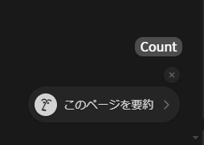

# Notion customization
## Features
### Layout
- Improve appearance.
- Improve usability.
- Refer to: layout.css

### Count word
- Counts the number of characters in the open document.
- Refer to: countWord.js and countWord.css

## Usage
- Install a plugin "[User JavaScript and CSS](https://chromewebstore.google.com/detail/user-javascript-and-css/nbhcbdghjpllgmfilhnhkllmkecfmpld)" to the Chrome.
- Open Notion.
- Access to "User JavaScript and CSS" from plugin button.
- Create a new rule.
- Past.
- Save.
- Reload Notion.
